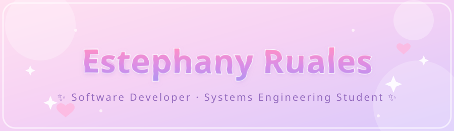

#  𝕎𝕖𝕝𝕔𝕠𝕞𝕖 𝕥𝕠 𝔼𝕤𝕥𝕖𝕡𝕙𝕒𝕟𝕪'𝕤 𝔾𝕚𝕥ℍ𝕦𝕓

  

---

I'm a 6th-semester Systems Engineering student at Universidad Libre – Pereira, Colombia, based in Pereira, Risaralda. I love turning what I learn in class into real, working projects — from full-stack web apps to small robotics builds. I'm currently sharpening my skills in Python, C++, and full-stack development, and always looking for new challenges to grow as a developer. Spanish is my native language, and I speak English at a B1 level. 🌸

---

### Tech Stack

**Languages**

**Frameworks & Libraries**

**Databases**

**Tools**

---

### GitHub Stats

<table align="center"> <tr> <td>  </td> <td>  </td> </tr> </table>

---

### Featured Projects

    
    

    
    

---

### 🌐 Let's Connect

    
        
    

